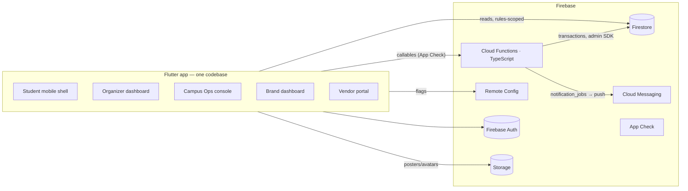
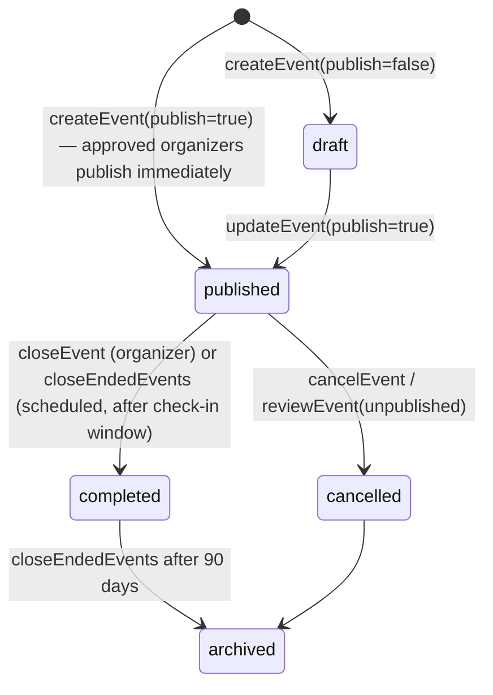
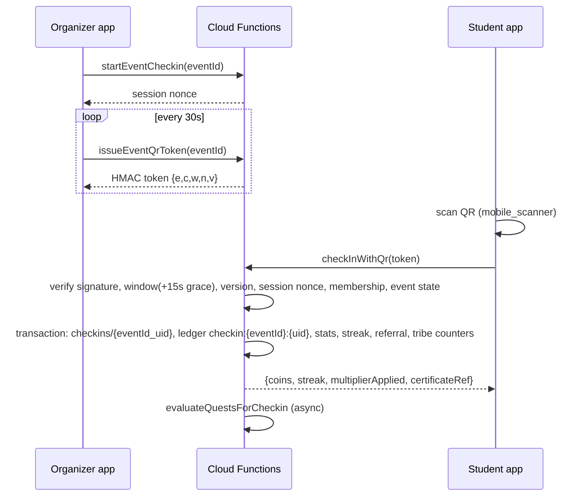

# CampusBuzz — Architecture

CampusBuzz is a Flutter (Android / iOS / web) client on a Firebase backend. The
client reads Firestore directly under strict security rules; every operation that
touches money-like state (BuzzCoins), attendance, roles, approvals or configuration
runs in a Cloud Function inside a Firestore transaction.



## Flutter structure

```
lib/
  main.dart · app/{bootstrap,app,shells}.dart
  core/
    auth/        authStateProvider, userProfileProvider, membershipProvider, rolesProvider, featureFlagsProvider, authPhaseProvider
    analytics/   Analytics abstraction (Firestore first-party sink, Firebase Analytics, optional PostHog)
    config/      AppConfig (dart-defines), FeatureFlag enum
    constants/   Col (collection names), Ids (deterministic ids)
    errors/      AppError — domain codes → product copy
    models/      immutable Firestore models
    navigation/  GoRouter with auth-phase redirects; DeepLinkService (app_links)
    network/     CbFunctions callable wrapper
    theme/       CbTheme (Material 3, Syne + DM Sans, dark-first), CbColors
    utils/       Fmt (campus-timezone rendering)
    widgets/     CbCard/CbChip/CbStat/CbPage, state views, charts
  features/<feature>/{data,presentation}   feature-first; business logic never lives in widgets
```

State management is Riverpod 3 (`StreamProvider` for Firestore snapshots,
`FutureProvider` for callables, `Notifier` for local UI state). Navigation is
`go_router` with a `StatefulShellRoute` for the student bottom nav and `ShellRoute`s
with a `DashboardShell` (navigation rail) for organizer / admin / brand / vendor /
platform workspaces. Role gating happens in `DashboardShell` **and** on the server.

## Backend structure

```
functions/src/
  config/     collections.ts (names + id helpers), defaults.ts (economy, flags, pilot bands, weights), secrets.ts
  domain/     pure TS, no Firebase: economy, streaks, qrToken, metrics, scorecard, recommendation, buzzScore, time, search, errors
  lib/        firestore (admin init, paging), auth (requireAuth/requireMembership/callableHandler), campus (config loading),
              ledger (idempotent credit/debit/expiry), notifications (jobs, caps, FCM), audit, analytics, options
  handlers/   auth, events, rsvp, checkin, feedback, rewards, friends, quests, admin, metrics, feed, surveys, scheduled, privacy
  index.ts    exports every function
```

`domain/` is unit-tested without an emulator (`npm test`); `handlers/` are tested
against the Firestore emulator by invoking `callable.run(request)` directly
(`npm run test:integration`); `firestore.rules` is tested with
`@firebase/rules-unit-testing` (`npm run test:rules`).

## Role system

Roles live only in `memberships/{campusId_uid}.roles` (plus `users.superAdmin`).
Clients can read their own membership but never write it; `setMembershipRole`
(campus admin) and `setSuperAdmin` (super admin) are the only writers and both
audit. Brand users are separate: `brand_memberships/{brandId_uid}`. Vendors are
memberships with role `vendor` and a `vendorId`. See `ROLE_PERMISSIONS.md`.

## Multi-campus isolation

Every campus-scoped document carries `campusId`; events additionally carry
`participatingCampusIds` for inter-campus events. Rules check
`memberships/{campusId_uid}` for the document's campus, so a member of campus A
cannot read campus B's events, metrics, audit logs, balances or redemptions. A user
has one `activeCampusId`; `setActiveCampus` switches context (must be a member).

## Event lifecycle



Publishing creates a `reviewStatus: pending_review` task for Campus Ops. Significant
edits (time/date/venue) notify confirmed RSVPs; cancellation notifies and cancels
reminders. Closing awards the organizer bonus once (`coin_ledger/organizer:{eventId}`)
and queues post-event feedback prompts for checked-in attendees (~2h after end).

## Check-in flow



Manual check-in (`manualCheckIn`) requires organizer authorisation, records
`method: manual` + reason, writes an audit entry and uses the same `recordCheckin`
transaction, so duplicates and double awards are impossible.

## Coin flow

`coin_ledger/{idempotencyKey}` is append-only; `coin_balances/{uid}` is a
materialised sum. Credits carry `remaining` and `expiresAt`; debits are matched FIFO
to credits by `applyLedgerFifo`; `expireBuzzCoins` writes an `expiry:` entry for the
unspent remainder only. `reconcileCoinBalance` recomputes from the ledger and audits
any drift. See `BUZZCOIN_ECONOMY.md`.

## Reward flow

`redeemReward` → transaction (reward active, inventory > 0, per-user limit, balance
≥ cost) → debit ledger (`redemption:{redemptionId}`) → decrement inventory → issue
human code + QR → `redemptions/{id}`. Vendor `validateRedemption` /
`fulfillRedemption` (scoped to their `vendorId`) → settlement month; admin
`settleVendorMonth` and `refundRedemption` (credits back once).

## Notification pipeline

Functions never push directly. They enqueue `notification_jobs/{dedupeKey}` with
`scheduledFor`; `processNotificationJobs` (every 5 min) claims jobs atomically,
applies preferences and the per-day engagement cap (default 2), sends via FCM
(multicast), prunes invalid tokens and logs to `notification_delivery_logs`.
Reminders (24h/1h) are created on RSVP and cancelled on RSVP cancel / event
cancel / time change. Feedback prompts are queued on event close.

## Analytics aggregation

Client funnel events → `analytics_events` (rules: own uid, create-only).
`aggregateDailyCampusMetrics` (nightly) → `metrics_daily/{campusId_date}`.
`refreshTribeLeaderboards` (30 min) → `tribe_leaderboards/{campusId_current}`.
`calculatePilotScorecard` (weekly) → `pilot_metrics/{campusId_weekKey}`.
`getCampusDashboard` computes live values on demand (bounded queries + counts).
See `ANALYTICS.md`.

## Environments

`--dart-define=CB_ENV=development|staging|production` and `USE_EMULATORS=true`
select behaviour; Firebase project selection is via `firebase_options*.dart`
generated by `flutterfire configure` and `.firebaserc` aliases. No production project
id lives in business code.
